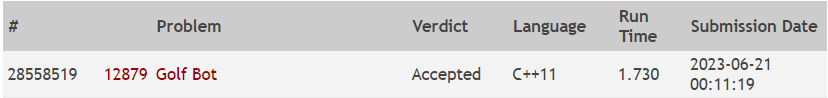

Questão do site [Online Judge](https://onlinejudge.org/) de numeração 12879

O problema consistia identiticar se é possivel acertar o buraco em uma partida de golf com apenas as distancias dadas e em duas tacadas apenas.

Foi utilizado uma transformada de fourrier para encontrar todas as distancias possiveis no sistema e comparar com as distancias da origem ao buraco.

