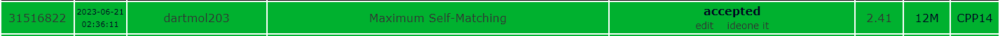

Questão do site [SPOJ](https://www.spoj.com/problems/MAXMATCH/) de nome MAXMATCH.

O problema consistia identiticar a maior taxa de encaixe ao se fazer shits para a direita e uma string comparada com a mesma.

Foi utilizado uma transformada de fourrier para comparar todas as convoluções das strings que foram tratadas como polinomios, de coeficientes 0 e 1 para cada letra das recebidas.

